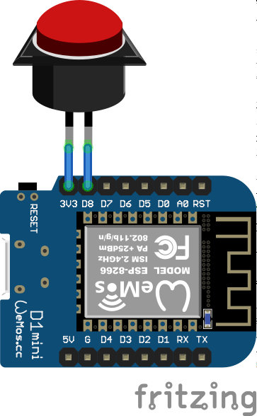

# Discord Push-to-Talk IoT Button

An ESP8266 microcontroller powered IoT button that triggers Discord's push-to-talk functionality over the network.

## How It Works

The `discord-server` folder contains a NodeJS webservice that publishes two endpoints on your network. When these endpoints are called the service triggers a keyboard press and release events for the configured key combination.

The `discord-device` folder contains code for a Wemos D1 Mini microcontroller that periodically checks the status of the attached button and calls the webservice endpoint through the WiFi network.

On Windows 10 this solution is working as expected. On MacOS Catalina the key combination is triggered, but for some reason the Discord desktop app does not handle it. If you have any idea why, plesae don't hesitate to share it with me!

## Getting Started

### Hardware

#### Bill of Materials

You need the following components to build this project:
- Wemos D1 Mini controller board
- Momentary push button

#### Wiring

Simply connect the push button to the `3V3` and `D8` pins of the Wemos D1 Mini. If you choose another pin, don't forget to update the code.

### Software

The software is in very proof-of-concept state, so don't expect it to be perfectly polished - but it works! :)

#### Device App

1. Install the [WiFiManager library](https://github.com/tzapu/WiFiManager) by tzapu.

2. Set the `WIFI_AP_SSID` and `WIFI_AP_PASSWORD` parameters in the code. These are the parameters for the wireless network the button will create the first time it starts.

3. Change the IP address in the `onButtonPressed` and `onButtonReleased` functions to the address of your desktop machine that runs the server.

Compile and upload the code to the Wemos D1 Mini.

After turning on the device the first time it will enter into configuration mode and will act as a WiFi access point. The SSID name and the password to connect to this access point can be specified in the `WIFI_AP_SSID` and `WIFI_AP_PASSWORD` parameters. Use your computer to connect to this network, then navigate to `http://192.168.4.1` in your web browser to open the configuration portal where you can select the preferred wireless network and set the WiFi password for the button.

#### Server

1. Install NodeJs.

2. Install dependencies by running `npm install`

3. Edit the `index.js` file and set your preferred Discord push-to-talk key binding in the `onDiscordPressRequest` and `onDiscordReleaseRequest` functions.

4. Start the service by running `node index.js`.

5. Open port `20314` on your firewall. On MacOS you have to run the app with `sudo` to handle incoming request from your network.

## Security

**This is proof-of-concept code with basically no security**, which means that a malicious user on your network can trigger your Discord push-to-talk feature.

Add HTTPS and configure a unique API key both in the device app and in the server for minimal security. 

## About the author

This project is maintained by [György Balássy](https://linkedin.com/in/balassy).
